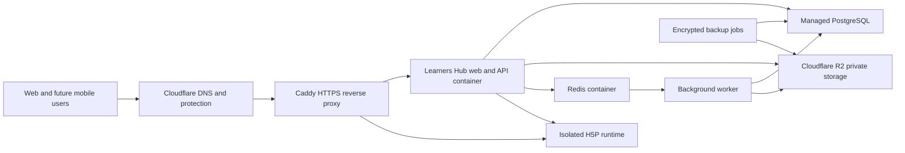

# VPS Container Architecture

Status: Accepted design
Date: 25 July 2026

## Purpose

Learners Hub will move from a Cloudflare Sites-specific runtime to a portable
containerized application hosted on a Hostinger VPS. The application layer
will run on the VPS while permanent school records and private file storage
remain in managed services outside the VPS failure domain.

The first deployment targets one pilot school. Tenant boundaries remain
mandatory so the platform can expand to multiple schools without redesigning
its identity, academic, assessment, or storage models.

## Understanding summary

- The complete application layer will be containerized on Hostinger.
- The VPS will run Caddy, the Learners Hub web/API application, H5P, and Redis.
- Managed PostgreSQL will hold permanent academic and identity records.
- Cloudflare R2 will hold private files, lesson media, submissions, H5P
  packages, and encrypted backups.
- The web and future Expo mobile application will use the same protected API.
- Reliability, privacy, recoverability, and tenant isolation take priority
  over keeping every component permanently free.
- KVM 1 is the development and staging target; KVM 2 is the minimum production
  target.

## Assumptions

- The first live deployment supports one pilot school with up to approximately
  1,000 registered users and 100 concurrent sessions.
- Hostinger KVM 1 currently provides 1 vCPU, 4 GB RAM, 50 GB NVMe storage, and
  4 TB monthly bandwidth.
- Hostinger KVM 2 currently provides 2 vCPU, 8 GB RAM, 100 GB NVMe storage, and
  8 TB monthly bandwidth.
- A production external-services budget of approximately US$20–50 per month is
  acceptable when a school begins relying on the platform.
- Neon is the initial managed PostgreSQL provider.
- Cloudflare R2 is the initial S3-compatible object-storage provider.
- Redis is disposable infrastructure and is not a source of truth.
- Ghana Data Protection Act requirements, auditability, least-privilege access,
  and tested recovery are production gates.
- One technical operator initially owns deployments, monitoring, security
  updates, and incident response.

Current Hostinger plan limits should be rechecked in hPanel before production
capacity is purchased:

- [Hostinger VPS plan limits](https://support.hostinger.com/en/articles/6976044-parameters-and-limits-of-hosting-plans-in-hostinger)

## Approaches considered

### 1. Hybrid Docker Compose

Hostinger runs the application services. Managed PostgreSQL and object storage
remain outside the VPS.

This is the selected approach because it fits KVM 1 during development, removes
permanent data from the VPS failure domain, and remains portable between
infrastructure providers.

### 2. Everything on the VPS

Hostinger also runs PostgreSQL and S3-compatible storage.

This has the lowest external-service cost but creates a single failure domain
for the application, database, and files. It also exceeds the safe operating
margin of KVM 1 and significantly increases backup and database-administration
responsibility.

### 3. Retain Sites and add VPS services

The current web application remains on Sites while Hostinger hosts H5P and
selected backend services.

This minimizes immediate migration work but preserves D1, R2 binding, and
platform-authentication coupling. It also creates split deployment and
debugging paths and does not satisfy the containerization objective.

## Final component architecture

### Learners Hub web and API

The existing application will move from vinext and Cloudflare Worker bindings
to a standard Node.js Next.js runtime. The web interface and application API
remain one modular monolith for the pilot. This conserves memory and CPU on KVM
1 while preserving explicit domain boundaries.

The application owns:

- authentication integration and sessions;
- tenants, schools, people, and guardianship;
- classes, subjects, assignments, and enrolment;
- curriculum, lessons, and learner progress;
- assessments, attempts, marking, and gradebooks;
- attendance, timetables, admissions, reports, and audit history;
- authorization for private files and H5P launches.

### H5P runtime

H5P remains an isolated service because uploaded packages contain executable
interactive content. Imports use signed package requests. Learner launches use
short-lived grants scoped to the school, learner, activity, lesson, and
published lesson version.

H5P owns package extraction, libraries, and player delivery. It does not own
academic scores, enrolment, lesson completion, or gradebook records.

### PostgreSQL

PostgreSQL is the source of truth for structured records. Drizzle ORM remains
the schema and migration layer, using the PostgreSQL dialect.

The production database is managed outside the VPS. Development uses a local
PostgreSQL container through a Compose profile.

### Object storage

Cloudflare R2 stores file bytes through its S3-compatible API. PostgreSQL stores
metadata, authorization context, ownership, checksums, status, and retention
rules.

Buckets are private. Files use opaque tenant-scoped keys. Public object URLs are
not stored in academic records.

- [Cloudflare R2 pricing](https://developers.cloudflare.com/r2/pricing/)
- [Cloudflare R2 data locations](https://developers.cloudflare.com/r2/reference/data-location/)

### Redis and background work

Redis supports queues, caching, distributed rate limits, and short-lived
coordination. Queue intents that must survive Redis loss originate from a
transactional PostgreSQL outbox.

KVM 1 runs background work with strict concurrency inside the main application
or as one lightweight process. KVM 2 separates it into a worker container.

## Authentication and authorization

Better Auth is selected as the lightweight application authentication layer.
It is backed by PostgreSQL and supports the Next.js web application, Expo
clients, secure native storage, and OAuth 2.1/OIDC flows.

- [Better Auth Expo integration](https://better-auth.com/docs/integrations/expo)
- [Better Auth OAuth/OIDC provider](https://better-auth.com/docs/plugins/oauth-provider)

Web sessions use secure, HTTP-only cookies. Native clients use authorization
code flow with PKCE and secure device storage. Staff accounts support
two-factor authentication.

Authentication and school authorization remain separate:

- Better Auth proves user identity.
- Learners Hub memberships resolve the active tenant and school role.
- Domain policies enforce class, subject, assignment, guardianship, and record
  access.
- Browser or token role claims never bypass a current PostgreSQL membership
  lookup.

Authentication records and school-person records use immutable links but remain
logically separate so changes to login methods cannot rewrite academic history.

## Protected request flow

1. Caddy terminates HTTPS and forwards the request.
2. Better Auth validates the session or bearer token.
3. Learners Hub resolves the active tenant membership.
4. Domain policies verify role, class, subject, and relationship access.
5. Structured changes commit transactionally in PostgreSQL.
6. Private files use authorized streaming or short-lived R2 access.
7. H5P launches receive signed, short-lived grants.
8. Slow work is recorded in the PostgreSQL outbox and dispatched through Redis.

## Development and production Compose profiles

The development profile contains:

- Learners Hub web/API;
- H5P;
- PostgreSQL;
- Redis;
- an S3-compatible development object store;
- Caddy or a direct local development endpoint.

The production profile contains:

- Caddy;
- Learners Hub web/API;
- H5P;
- Redis;
- a separate worker on KVM 2.

Production connects to Neon and R2 and never starts local PostgreSQL or object
storage containers.

## KVM resource plan

### KVM 1: development and staging

| Service | Approximate memory limit |
|---|---:|
| Learners Hub web/API | 1 GB |
| H5P runtime | 1.25 GB |
| Redis | 256 MB |
| Caddy | 128 MB |
| Operating system and safety margin | approximately 1.3 GB |

KVM 1 is not approved as the long-term production tier. Work concurrency,
Node.js heap size, H5P imports, and log retention must be limited.

### KVM 2: production minimum

KVM 2 provides enough headroom to separate the worker, absorb ordinary traffic
bursts, perform H5P imports, and avoid routine memory pressure. Capacity must be
measured with production-shaped load tests before onboarding more than the
pilot school.

## Container security

- Multi-stage builds produce minimal runtime images.
- Containers use non-root users.
- Images contain no secrets or production configuration.
- Services use read-only filesystems where supported and explicit writable
  volumes where required.
- Health and readiness checks gate deployments.
- Redis and H5P internal ports are not publicly exposed.
- The VPS exposes only HTTP, HTTPS, and restricted SSH.
- SSH uses keys, not passwords.
- Firewall rules, automated security updates, log rotation, and brute-force
  protection are enabled.
- Images and dependencies are scanned before production approval.

## Deployment workflow

1. Run domain, integration, authorization, contract, and rendered-flow tests.
2. Run type-checking, linting, and the production build.
3. Build and scan immutable container images.
4. Publish commit-tagged images to GitHub Container Registry.
5. Require explicit production approval.
6. Create a pre-migration database backup.
7. Pull exact image versions on the VPS.
8. Run forward-compatible database migrations.
9. Start services and wait for readiness checks.
10. Roll back the application version when health checks fail.

Deployments must reference immutable commit tags or image digests rather than
mutable `latest` tags.

## D1 and R2 migration

The current D1 schema will be converted from SQLite-oriented Drizzle
definitions to PostgreSQL definitions. Identifiers and audit history remain
stable while database-specific indexes, constraints, timestamps, and queries
are adapted explicitly.

Cutover sequence:

1. Add PostgreSQL and S3 adapters behind repository interfaces.
2. Generate and validate PostgreSQL migrations on a clean database.
3. Export current D1 records and R2 objects.
4. Import records idempotently while preserving identifiers.
5. Compare record counts, relationships, audit events, and file checksums.
6. Place the old deployment in read-only mode.
7. Apply the final delta and start the VPS application.
8. Switch DNS.
9. Retain the old deployment for rollback without accepting new writes.

Indefinite dual writes are explicitly rejected because they create
reconciliation risk.

## Backup and recovery

- Use managed PostgreSQL point-in-time recovery on the production plan.
- Produce nightly encrypted PostgreSQL exports into a dedicated private R2
  backup bucket.
- Produce daily H5P volume archives with integrity manifests.
- Retain thirty daily and twelve monthly backup generations initially.
- Run quarterly restore tests into an isolated environment.
- Do not back up Redis; reconstruct queues and caches from PostgreSQL.
- Retain application releases so code and database migrations can be restored
  together.

No real learner data may be migrated until a complete restore exercise
succeeds.

## Failure behavior

- H5P failure does not prevent ordinary lesson content from loading.
- R2 failure pauses uploads without making academic records unavailable.
- Redis failure pauses background work; PostgreSQL outbox events are replayed
  when Redis returns.
- PostgreSQL failure stops writes explicitly. The UI must not report an
  uncommitted attendance, assessment, grade, or admission change as successful.
- Learner responses buffer locally during short connectivity interruptions and
  submit idempotently when the connection returns.
- Failed migrations prevent the new application version from becoming healthy.

## Non-functional requirements

### Scale and performance

- Up to approximately 1,000 registered users in the pilot.
- Approximately 100 concurrent sessions on KVM 2.
- 95% of ordinary authenticated API responses below 500 ms, excluding uploads
  and generated documents.
- Quiz autosave acknowledgement below one second under expected pilot load.
- Production-shaped load tests are required before school onboarding.

### Reliability

- 99.5% monthly availability target for the pilot.
- Four-hour recovery-time objective.
- Fifteen-minute database recovery-point objective when managed point-in-time
  recovery is active.
- Nightly encrypted exports provide an independent disaster backup.

### Security and privacy

- Tenant isolation is enforced in application authorization and repository
  queries.
- Private files require server-authorized access.
- Sensitive changes create immutable audit events.
- Staff two-factor authentication is supported.
- Secrets remain outside source control and container images.
- Data processing, retention, subject rights, and incident handling must comply
  with applicable Ghanaian privacy obligations before production use.

### Maintenance

- One operator initially owns deployments and incident response.
- Dependency and base-image updates are reviewed regularly.
- Disk, memory, error rate, certificate, backup, and service-health alerts are
  required.
- Sustained memory swapping or disk usage above 80% triggers remediation or
  capacity upgrade.

## Testing strategy

- Domain-policy tests for academic, assessment, authorization, and reporting
  invariants.
- PostgreSQL integration tests against an actual test database.
- Object-storage adapter and private-file authorization tests.
- Better Auth session, token, two-factor, and tenant-membership tests.
- Cross-tenant denial tests for every protected module.
- API contract tests shared with the future mobile client.
- H5P import, launch-grant, and xAPI forwarding tests.
- Browser journey tests for critical learner, teacher, guardian, and
  administrator workflows.
- Production-shaped load and soak tests.
- Backup restoration and migration rollback exercises.
- Dependency, secret, and container-image scanning.

## Risks and mitigations

| Risk | Mitigation |
|---|---|
| KVM 1 CPU or memory exhaustion | Strict limits, low worker concurrency, managed data services, KVM 2 production gate |
| VPS failure | Managed PostgreSQL, R2 storage, encrypted external backups, reproducible Compose deployment |
| Cross-tenant data exposure | Central authorization policies, tenant-bound repositories, denial tests, audit events |
| H5P package vulnerability | Isolated runtime, signed imports, restricted framing and network access, patch cadence |
| Migration data loss | Idempotent import, identifier preservation, checksums, read-only cutover, tested rollback |
| Dependency outage | Bounded degradation, PostgreSQL outbox, explicit failure states, retry controls |
| Free-tier suspension or limits | Production budget, usage alerts, documented upgrade thresholds |
| Single-operator dependency | Runbooks, automated deployments, restore exercises, secret-recovery procedure |

## Implementation phases

1. Add the standard Node.js Next.js runtime and root application Dockerfile.
2. Add development and production Compose profiles.
3. Introduce PostgreSQL repository and migration adapters.
4. Replace platform header authentication with Better Auth.
5. Replace Worker-bound R2 access with the S3-compatible adapter.
6. Add the PostgreSQL outbox, Redis dispatch, and bounded worker.
7. Build migration and verification tooling for current D1/R2 data.
8. Add CI image builds, scanning, and deployment automation.
9. Run integration, security, load, backup, and restore tests.
10. Deploy to KVM 1 staging.
11. Upgrade to KVM 2, perform production cutover, and monitor the pilot.

## Decision log

| Decision | Alternatives | Reason |
|---|---|---|
| Use hybrid Docker Compose | Everything on VPS; retain Sites | Portability without placing permanent data in the VPS failure domain |
| Use KVM 1 for development only | Treat KVM 1 as production | One vCPU and 4 GB RAM do not provide safe production headroom |
| Require KVM 2 for production | Upgrade later only after failures | Establishes a capacity gate before a school depends on the platform |
| Keep the pilot as a modular monolith | Introduce NestJS immediately | Reduces runtime overhead and migration scope while preserving domain boundaries |
| Use managed PostgreSQL | PostgreSQL container on VPS | Better durability, recovery, and operational isolation |
| Use Cloudflare R2 through S3 APIs | MinIO on VPS; database blobs | Durable private media storage with low cost and no VPS disk coupling |
| Run Redis on the VPS | Managed Redis immediately | Redis is disposable and inexpensive to operate for the pilot |
| Use Better Auth | Keycloak; Sites platform headers | Lower resource use, PostgreSQL integration, web and Expo support, OAuth/OIDC path |
| Keep H5P isolated | Execute H5P in the web container | Reduces the security and failure impact of third-party interactive packages |
| Use a PostgreSQL outbox | Depend on Redis durability | Preserves important asynchronous work through Redis outages |
| Avoid indefinite dual writes | Keep Sites and VPS active together | Prevents reconciliation ambiguity during migration |
